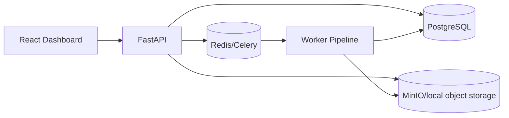

# CineTag Pipeline — Distributed Video Processing + LLM Content Tagging System
Production-grade portfolio project inspired by large-scale streaming/media workflows.

## Highlights
- FastAPI + Celery + Redis + PostgreSQL + MinIO architecture
- Asynchronous multi-stage pipeline for video metadata, frame sampling, scene segmentation, transcript/tag/embedding generation
- Human-in-the-loop review queue with audit logs
- Semantic search using deterministic embeddings and DB-backed indexing
- Observability: structured logging patterns + Prometheus metrics endpoint (`/metrics`)

## Architecture


## Setup
1. `cp .env.example .env`
2. `make up`
3. `make seed`
4. open API at `http://localhost:8000/docs` and frontend at `http://localhost:5173`

## Docs
- `docs/system-design.md`
- `docs/resume-bullets.md`
- `docs/interview-talking-points.md`
- `docs/deploy-render.md`
- `docs/deploy-gcp-cloud-run.md`

## Deploying to Google Cloud Platform
See `docs/deploy-gcp.md` for full Terraform and gcloud deployment steps.

## GCP Verification Flow
1. Check API:
```bash
curl $API_URL/health
curl $API_URL/ready
curl $API_URL/api/videos
```
2. Check signed upload init:
```bash
curl -X POST $API_URL/api/uploads/init \
  -H "Content-Type: application/json" \
  -d '{"filename":"test.mp4","content_type":"video/mp4","size_bytes":12345,"title":"test"}'
```
3. Check frontend: open `$FRONTEND_URL`.
4. Check GCS:
```bash
gcloud storage ls gs://cinetag-distributed-video-media/originals/
```
5. Check worker:
```bash
gcloud run services logs read cinetag-worker --region us-central1 --limit 100
```

Signed URL generation on Cloud Run may require `roles/iam.serviceAccountTokenCreator`.
