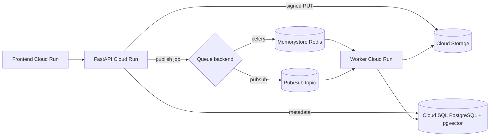

# Deploy CineTag on GCP Cloud Run

This guide provides a production-oriented deployment flow for CineTag on Google Cloud Platform using Cloud Run for stateless services, Cloud SQL for PostgreSQL, Memorystore for Redis, and Cloud Storage for media artifacts.

## 1) Target topology

CineTag is deployed as **three independent Cloud Run services**:

- `cinetag-api` (FastAPI control plane)
- `cinetag-worker` (Celery worker process)
- `cinetag-frontend` (Next.js standalone app)

Supporting services:

- **Cloud SQL (PostgreSQL)** for core relational state
- **Memorystore Redis** for Celery broker/result backend
- **Cloud Storage** for original videos and derived artifacts
- **Artifact Registry** for API/worker/frontend container images
- **Secret Manager** for sensitive runtime configuration
- **Pub/Sub** for production job dispatch (optional, Celery remains supported)



---

## 2) Prerequisites

- Google Cloud project with billing enabled
- `gcloud` CLI authenticated (`gcloud auth login`)
- `terraform` >= 1.5
- Docker (for local builds, optional if using Cloud Build only)
- Required APIs enabled (Cloud Run, Cloud Build, Artifact Registry, Secret Manager, Cloud SQL Admin, Redis, Storage)

Set project/region:

```bash
gcloud config set project cinetag-distributed-video
gcloud config set run/region us-central1
```

---

## 3) Build and push container images

Build API, worker, and frontend images before creating Cloud Run resources:

```bash
gcloud builds submit --config cloudbuild.yaml \
  --substitutions _PROJECT_ID=cinetag-distributed-video,_REGION=us-central1
```

If you split pipelines, you can also use `cloudbuild.api.yaml` and `cloudbuild.frontend.yaml` with equivalent substitutions.

---

## 4) Provision infrastructure with Terraform

From `infra/terraform`:

```bash
terraform init
terraform plan -var="project_id=cinetag-distributed-video"
terraform apply -var="project_id=cinetag-distributed-video"
```

Key outputs to capture:

- API URL
- Frontend URL
- Bucket name
- Cloud SQL connection name
- Service account identities

---

## 5) Runtime configuration essentials

Terraform wires most values on Cloud Run. Prefer **Cloud SQL Auth Proxy socket** style configuration (no `DATABASE_URL`):

- `APP_ENV=gcp`
- `CLOUD_SQL_CONNECTION_NAME` (from Terraform output)
- `DATABASE_PASSWORD` (Secret Manager secret `DATABASE_PASSWORD`, also injected as env from secret ref)
- `SECRET_MANAGER_ENABLED=true` (API/worker/migrate job load additional secrets such as `OPENAI_API_KEY` when not set inline)
- `AUTH_ENABLED=true` with `ADMIN_API_KEY`, `REVIEWER_API_KEY` (API) and `SERVICE_API_KEY` (worker automation / retry from trusted callers)
- Clients send `X-API-Key`. For the Next.js app, set `NEXT_PUBLIC_API_KEY` (or role-specific vars) only in trusted demos — prefer server-side callers for production.
- `QUEUE_BACKEND` (`celery` or `pubsub`)
- Redis URL for Celery (`REDIS_URL` from Memorystore)
- `STORAGE_BACKEND=gcs`, `GCS_BUCKET_NAME`
- `GCP_PROJECT_ID`, `GCP_REGION`
- `PUBSUB_TOPIC_NAME`, `PUBSUB_SUBSCRIPTION_NAME` (when using pubsub)
- `SEMANTIC_SEARCH_BACKEND` (`auto` recommended)
- Optional: `OTEL_ENABLED`, `OTEL_EXPORTER_OTLP_ENDPOINT`, `OTEL_SERVICE_NAME`

**Import note:** If `DATABASE_PASSWORD` (or other secrets) already exist in the project, use `terraform import` on the `google_secret_manager_secret` resources before apply, or adopt the generated versions and rotate the Cloud SQL user password to match.

Optional: set Terraform `api_ingress` to `INGRESS_TRAFFIC_INTERNAL_LOAD_BALANCER` for private API behind a load balancer; default remains public for demos.

Ensure **pgvector** is enabled on the Cloud SQL database (extension installed once as an admin); use `PGVECTOR_ENABLED=true` (default) and `SEMANTIC_SEARCH_BACKEND=auto` unless operating in pure-Python search mode.

Frontend requires:

- `NEXT_PUBLIC_API_BASE_URL=<api-cloud-run-url>`

---

## 6) IAM and security-critical permissions

Required permissions include:

- API service account can sign URLs (token creator capability)
- API and worker service accounts can read required Secret Manager secrets
- API/worker principals can access Cloud SQL and Redis
- Bucket CORS allows browser `PUT` uploads from frontend origin

If signed uploads fail, validate service-account token/signing permissions first.

---

## 7) Post-deploy verification checklist

Health and readiness:

```bash
curl $API_URL/health
curl $API_URL/ready
```

Control-plane behavior:

```bash
curl $API_URL/api/videos
curl -X POST $API_URL/api/uploads/init \
  -H "Content-Type: application/json" \
  -d '{"filename":"test.mp4","content_type":"video/mp4","size_bytes":12345,"title":"test"}'
```

Storage and worker activity:

```bash
gcloud storage ls gs://<bucket>/originals/
gcloud run services logs read cinetag-worker --region us-central1 --limit 100
```

---

## 8) Common failure modes and fixes

1. **Cloud Run deploy fails due to missing image**
   - Build/push image first, then redeploy.
2. **Uploads fail on browser PUT**
   - Verify bucket CORS and signed URL permissions.
3. **Jobs stuck in queued state**
   - Confirm worker service is healthy and Redis connectivity works.
4. **Semantic search quality degraded**
   - Ensure embedding provider consistency; re-embed corpus when provider changes.
5. **Intermittent OpenAI failures**
   - With `PROVIDER_STRICT=false`, pipeline falls back to mock and marks job partially completed.

---

## 9) Migration and rollback

### Apply sequence

1. `terraform apply` to provision VPC, private Cloud SQL, Redis network, and Pub/Sub.
2. Run DB migration to add pgvector columns/index.
3. Deploy API + worker with new queue environment variables.
4. Keep `QUEUE_BACKEND=celery` initially; switch to `pubsub` only after topic/subscription and consumer readiness are verified. The worker Cloud Run service should keep the entry command `python -m app.workers.worker_service_main`: it starts the HTTP health server and spawns either the Celery worker (`worker_main`) or the Pub/Sub pull consumer (`pubsub_consumer`) according to `QUEUE_BACKEND`.

### Rollback plan

- Set `SEMANTIC_SEARCH_BACKEND=python` to bypass pgvector query path.
- Set `QUEUE_BACKEND=celery` to revert dispatch to Redis/Celery.
- Re-deploy previous container images if needed.

## 10) Operational recommendations

- Set Cloud Monitoring alerts for API p95 latency, worker error rate, and queue depth.
- Separate API and worker min/max instances to independently tune cost/performance.
- Define Cloud Storage lifecycle policies to clean stale `upload_pending` artifacts.
- Keep database migrations automated as part of release workflow.
- Use per-environment projects or at least isolated service accounts/secrets.
