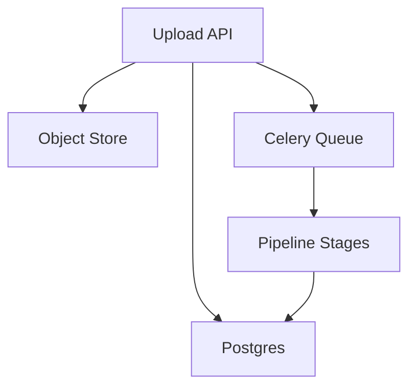

# System Design
## Problem statement
Build a local-first distributed media intelligence platform for asynchronous video analysis and LLM tagging.
## Functional requirements
Upload, process, tag, review, search.
## Non-functional requirements
Idempotent stages, retries, observability, maintainability.
## Architecture

## Failure handling
Stage-level exception capture and retry.
## Scaling to millions of videos
Shard queues by workload class, separate CPU/GPU pools, external vector DB.
